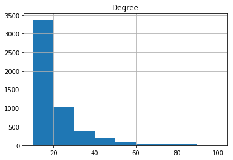

Wikiscraper Recommender
=========================
---------
About
---------

A Python library with tools to scrape Wikipedia for the "See All" connections between articles, store the information in a
graph, and perform graph analysis on the graph, including clustering.

Accessible at <a href="https://jerlevickdi.herokuapp.com/">jerlevickdi.herokuapp.com</a>

<a href="https://github.com/jerlevick/wiki-graph">Github</a>

Created by <a href="mailto:jeremy.levick@mg.thedataincubator.com">Jeremy Levick</a> 
----------
The Graph
----------

By starting from 32 starting points, representing a diverse array of major history topics, we search breadth-first through the
"See All" section to a depth of three, eventually culminating in 78,244 Wikipedia pages; already at this depth we start 
to include pages that are outside the scope of the project, and the graph analysis became slow and clunky.

We expect the graph to have some properties of a scale-free network; at the very least, exhibiting a heavy-tailed distribution of the 
node degrees, and this is exactly what we observe: 

This presents some difficulties for clustering, as a smaller number of pages exhibit a vast majority of the connectivity in the graph.

It is perhaps interesting to note which pages exhibit the most "centrality"; using <a href="https://en.wikipedia.org/wiki/Eigenvector_centrality">eigenvector centrality</a>, we see that the 
pages with the most centrality are Nazism or Fascism adjacent ('List of books about Nazi Germany' is the most central, and 'Canadian Union of Fascists',
along with three pages related to Bulgarian Fascism complete 5 of the top-6); followed by Catholic Church adjacent ('Index of Catholic Church articles', 
'Index of Vatican City–related articles'), WWII more generally ('Events preceding World War II in Asia' and 'WWII' itself), and Islam (Islam by country', 
'Islam in South Asia'). These are probably unsurprising, but do suggest a possible recency bias, especially with the prevalence of WWII-related topics.

-------------
The Clusters
-------------

By doing a transfer-matrix spectral projection to 10-dimensions, we obtained a representation of the graph as points in 10-d space, on which
we performed k-means clustering. Then a cluster multigraph was created, representing each cluster as a node, with an edge between a pair of 
clusters for each edge between pairs of pages with one page in each cluster. 

While the results of this clustering were not perfect, there are some clusters that seem identifiably correct; using a pre-trained Word2Vec
model to assign descriptions to clusters automatically, and selecting randomly five clusters, we find:

- A 'law'/'companies'/'business'/'legal'/'corporate' cluster, containing such pages as 'United States corporate law', 'United Kingdom company law',
'Shareholder', 'Board of Trade', and other obviously relevant pages

- A 'intelligence'/'military'/'covert'/'cia'/'spy'/'operations'/'secret'/'surveillance' cluster containing 'Black project', 'Counter-intelligence', 
'Covert Warfare', 'Filibuster (military)', 'HUMINT', 'clandestine', 'operational techniques', 'Military intelligence'

- A 'states'/'united'/'american' cluster containing 'Economic history of the United States', 'Benjamin Franklin', 'Politics in Washington', 
'Elections in Washington'; although also lists of saints of various countries, 'List of Turkish films', and, most strangely, topics relating to 
ancient Carthage

Less convincingly, the five random clusters are rounded out by 
- A cluster containing 'History of the United Arab Emirates', a few articles relating to the history of Bahrain, but then Roman and Greek deities, and
the Italo-Abyssinian war; Word2Vec provides no strong description for this other than 'history'

- A cluster containing some early-20th century topics, but then the 'Philippines Campaign (1944-1945)', 'Dusseldorf School of Painting', and 'Feminist therapy'.
Word2Vec suggests only 'history'/'war' as potential descriptions

In short, although the cluster seems to work pretty well at identifying reasonable clusters, there are a few that it struggles with, either dumping extra
topics into onces that may have a core (History of UAE and Bahrain), or sometimes coming up with single-page clusters (the American artist 'Dorothea Lange' 
makes up her own cluster, categorized as 'american'/'women'/'artists'), or reasonable but overly broad clusters ('war'/'states'/'countries' is massive, and 
covers topics ranging from medieval Chinese wars to WWII (unsurprisingly) and the Lord's Resistance Army.  

This suggests that the projection to 10-d, followed by clustering is at least finding real data in here, even if the parameters can probably be tweaked to 
improve results. 

This cluster graph, too, was expected to exhibit some scale-free properties, and again, a heavy-tailed distribution of the degrees was observed:

---------------
The Recommender Algorithm
---------------

We can perform some statistics to try get a sense of whether the recommender is performing well. Given an input, the algorithm outputs up to 10 Wikipedia pages that are judged to be potentially relevant. We can get a sense of how good these outputs are by measuring either the word2vec similarity of the two articles (attempting to judge whether the two topics are semantically similar), or the distance between the Wikipedia page for the initial topic and its recommended topics in our graph.
Of course neither of these measures is perfect, but without some element of human judgement, or an outside test set to compare to, it is probably the best we will be able to do for now. 

For a first pass, we can use the fact that our Wikipedia graph was obtained by starting with 32 prototypical Wikipedia pages and doing breadth-first search to a distance of 3. If we see what the algorithm recommends for these initial starting pages, we can get a sense of whether it is just recapitulating the inputs by whether the recommendations are typically within a distance of 3--if the algorithm recommends topics of distance greater than 3, than it is discovering structure deeper than just the immediate nearest neighbour structure. 

As we can see, 

we do in fact observe this; most recommendations are not just nearest neighbours of the input. 

We can also do an analysis on the pre-defined possible inputs, to see if the results are "close" in the senses defined above. 

The distance results seem to confirm that we are not just drawing directly on the graph structure; the similarity results show that we have mostly reasonable, if not outstanding similarity between inputs and results; but it is difficult to be certain to what extent this is owing to limitations of the clustering, of the word2vec representation of topics, or other reasons, without a more robust and reliable way to evaluate the results.
